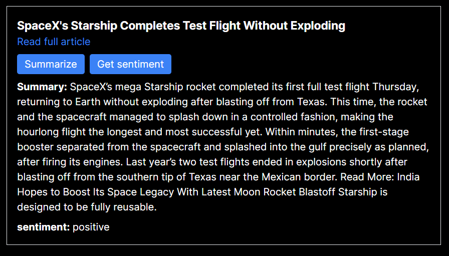

# News Aggregator

## Introduction
This is a Next.js web application that serves as a news aggregator, incorporating machine learning functionalities for article summarization and sentiment detection. The app aggregates top articles from predefined news sources, provides summaries of articles, and detects their sentimentes. It consists of frontend components for displaying the feed, article list, and individual articles, as well as backend APIs for retrieving top articles, summarizing articles, and detecting sentiment.

## Project Structure

- **components**: Contains React components responsible for rendering different parts of the user interface. `Feed.tsx` renders the main feed page, `ArticleList.tsx` renders a list of articles, and `ArticleItem.tsx` renders an individual article item.
- **api**: Includes backend API endpoints for interacting with the machine learning scripts and retrieving data for the frontend. The `top-articles` endpoint retrieves top articles, the `sentiment` endpoint detects sentiment, and the `summary` endpoint provides article summaries.
- **ml**: Houses Python scripts for performing machine learning tasks. `top_articles.py` scrapes top articles from predefined news sources, `sentiment.py` detects the sentiment of articles, and `summary.py` generates summaries of articles.

## Usage
To run the application:
1. Ensure you have Node.js and Python installed on your machine.
2. Install the required dependencies by running `npm install` and `pip install -r requirements.txt`
3. Start the Next.js development server by running `npm run dev`.
4. Access the application at `http://localhost:3000`.

## Dependencies
- Next.js: Framework for building React applications
- Newspaper4k: Library for web scraping news articles
- Transformers: Library for natural language processing tasks

## Features
- **Top Articles Retrieval**: Scrapes top articles from predefined news sources.
- **Article Summarization**: Summarizes articles to provide concise representations.
- **sentiment Detection**: Determines the sentiment of articles based on sentiment analysis.

### Top Articles Retrieval
The script scrapes the top articles from predefined news sources listed in the `newspaper_list`. It utilizes the `newspaper` library to build newspaper objects from these URLs. The `get_top_articles` function takes a newspaper URL and retrieves a specified number of top articles (default is 5) from it. It then extracts relevant information from each article, including its title, publication date, text content, and URL. This feature enables the aggregation of recent articles from multiple news sources.

### Article Summarization
For article summarization, the script employs the `summarize` function. This function takes an article URL as input and utilizes the `newspaper` library to download, parse, and perform natural language processing (NLP) on the article. By leveraging NLP, it generates a summary of the article's content. This summary provides a condensed representation of the article's main points, making it easier for users to grasp the essential information without having to read the entire article.

### Sentiment Detection
The script includes a `detect_sentiment` function that determines the sentiment of articles based on sentiment analysis. It utilizes the `transformers` library to load a sentiment analysis model pretrained on English text. The sentiment analysis model assigns a sentiment score to the text, indicating the overall sentiment (positive, negative, or neutral). Based on this score, the function categorizes the article's sentiment as 'left-leaning,' 'right-leaning,' or 'neutral.'

## Demo

Once loaded, the web application constructs a dynamic feed featuring the most recent articles from renowned newspapers.

For each article, we can initiate our Python scripts via an API call. These scripts, powered by machine learning models, execute specified tasks and deliver responses in JSON format which is integrated into the React components

